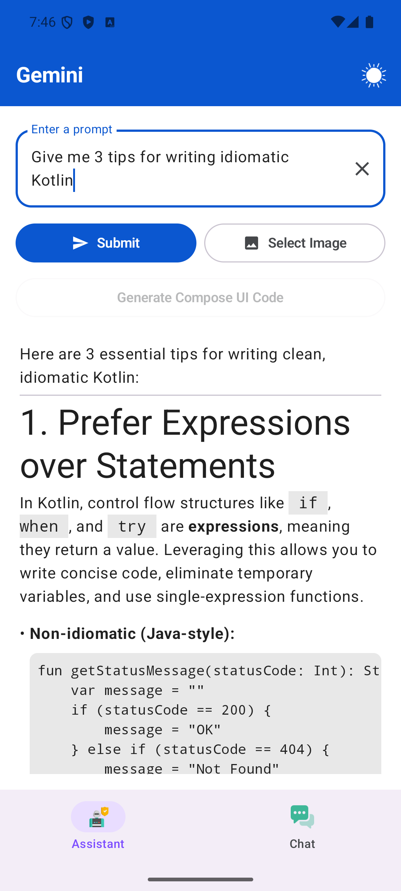
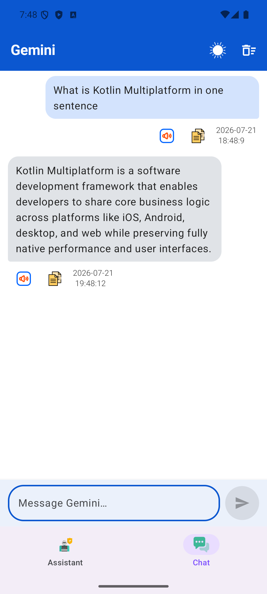
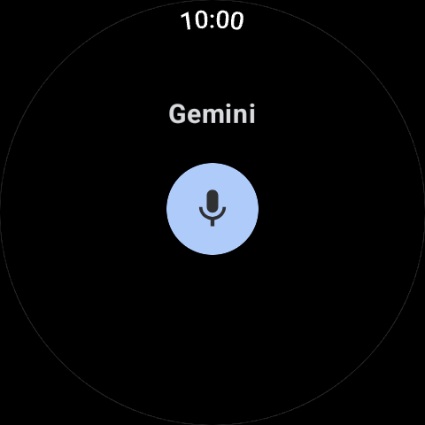
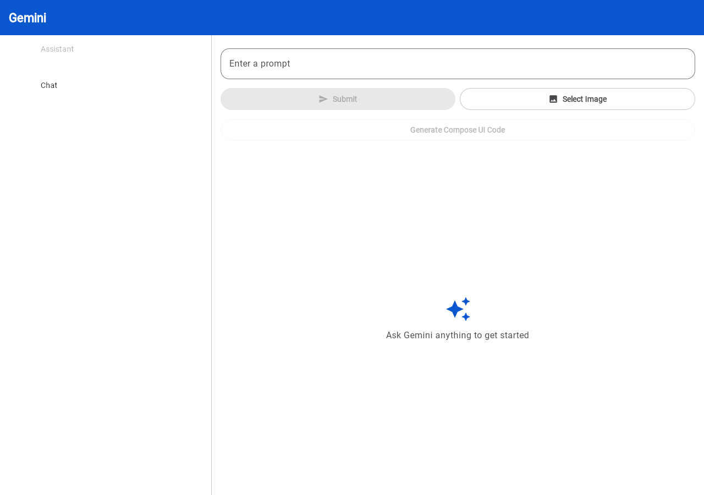

Kotlin/Compose Multiplatform sample to demonstrate Gemini Generative AI APIs (text and image based queries). 
Uses [Generative AI SDK](https://github.com/PatilShreyas/generative-ai-kmp).

Running on
* iOS 
* Android
* Wear OS (contributed by https://github.com/yschimke)
* Desktop
* Web (Wasm)

Set your Gemini API key (`gemini_api_key`) in `local.properties` (which should also
contain your Android `sdk.dir`).

## Building

The project is split into per-platform modules:

* `androidApp` — Android application
* `wearApp` — Wear OS application
* `composeApp` — shared Kotlin Multiplatform code plus the Desktop and Web (Wasm) entry points
* `iosApp` — iOS application (Xcode project)

Run each target with:

* **Android** — `./gradlew :androidApp:installDebug` (or run the `androidApp` configuration from Android Studio)
* **Wear OS** — `./gradlew :wearApp:installDebug`
* **Desktop** — `./gradlew :composeApp:hotRunDesktop` (or `packageDistributionForCurrentOS` to build a native installer)
* **Web (Wasm)** — `./gradlew :composeApp:wasmJsBrowserDevelopmentRun`
* **iOS** — open `iosApp/iosApp.xcodeproj` in Xcode and run

Related posts:
* [Exploring use of Gemini Generative AI APIs in a Kotlin/Compose Multiplatform project](https://johnoreilly.dev/posts/gemini-kotlin-multiplatform/)

## Screenshots

### Android

| Assistant | Chat |
|:---:|:---:|
|  |  |

### iOS

### Wear OS

### Wasm based Compose for Web

## Full set of Kotlin Multiplatform/Compose/SwiftUI samples

*  PeopleInSpace (https://github.com/joreilly/PeopleInSpace)
*  GalwayBus (https://github.com/joreilly/GalwayBus)
*  Confetti (https://github.com/joreilly/Confetti)
*  BikeShare (https://github.com/joreilly/BikeShare)
*  FantasyPremierLeague (https://github.com/joreilly/FantasyPremierLeague)
*  ClimateTrace (https://github.com/joreilly/ClimateTraceKMP)
*  GeminiKMP (https://github.com/joreilly/GeminiKMP)
*  MortyComposeKMM (https://github.com/joreilly/MortyComposeKMM)
*  StarWars (https://github.com/joreilly/StarWars)
*  WordMasterKMP (https://github.com/joreilly/WordMasterKMP)
*  Chip-8 (https://github.com/joreilly/chip-8)
